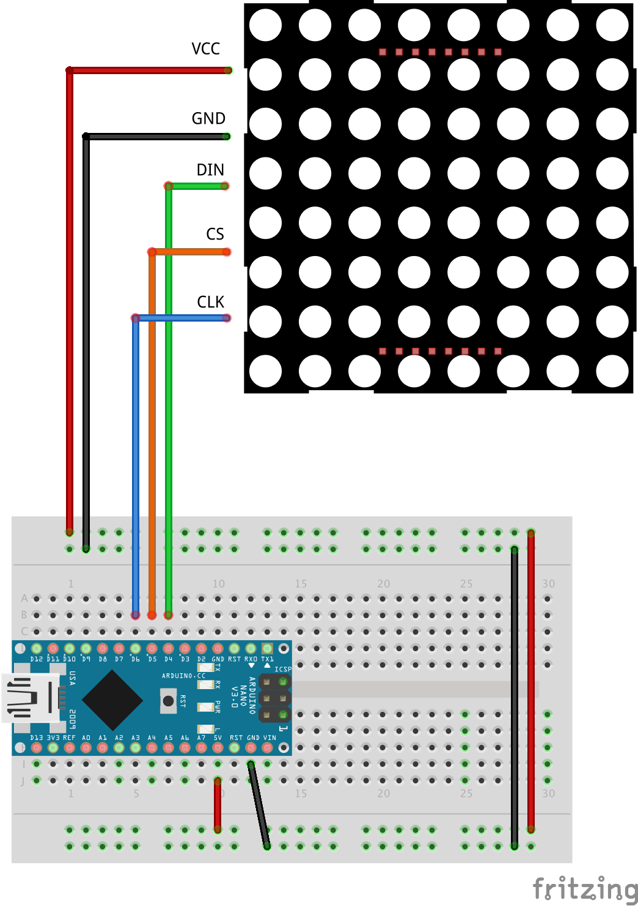

# Smiley on LED matrix

This project uses Arduino and LED matrix 8x8 to display an animated smiley.

Components:
* Arduino (preferably Micro or Nano to place it into the board)
* 8x8 LED matrix module with MAX7219 driver and SPI interface (VCC, GND, DIN, CS, CLK)

Library used:
* **LedControl** by *Eberhard Fahle* (version 1.0.6)
  * see the author's website for usage information http://wayoda.github.io/LedControl/pages/software.html

Instructions:
1) Connect the matrix module the following way
   * VCC -> 5V
   * GND -> Ground pin
   * DIN -> pin 4
   * CS  -> pin 5
   * CLK -> pin 6
2) Open the program `.ino` code in Arduino IDE
3) If you connect the pins differently, don't forget to change this line with the ones you used: `LedControl matrix = LedControl(4, 5, 6, 1);`
4) Install the **LedControl** library (Tools -> Manage Libraries)
5) Connect Arduino to your computer
6) Set up the board type and port in Tools
7) Hit the Upload button to upload the program into your Arduino. 

**Output:** The program should display a loading animation, then there should be a smiley face displayed. It should blik and wink from time to time.

Feel free to play around, change the animation or create your own!

The project schematics