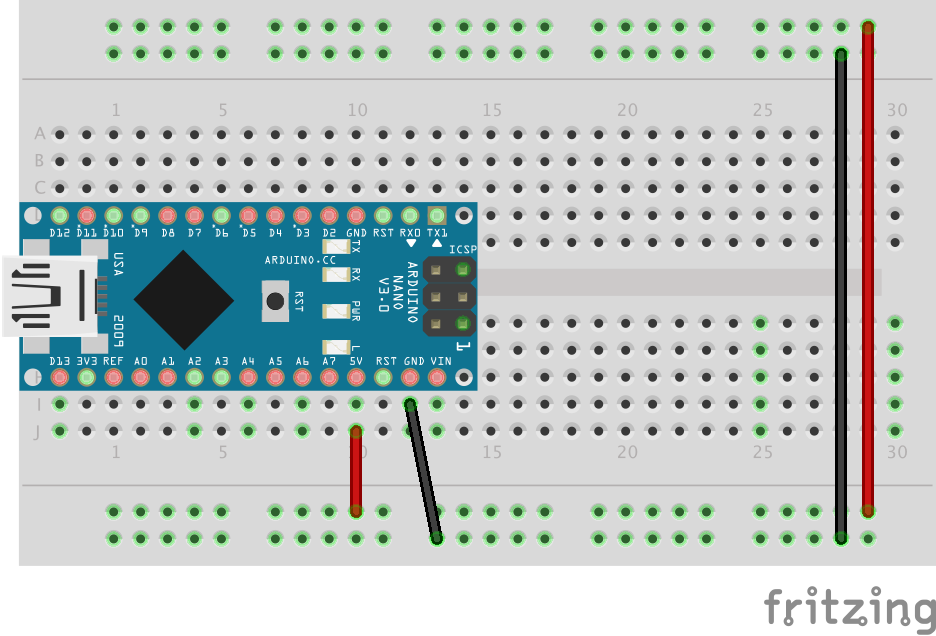

# Smiley on LED matrix

Project description

## Components
* Arduino (preferably Micro or Nano to place it into the board)
* 8x8 LED matrix module with MAX7219 driver and SPI interface (VCC, GND, DIN, CS, CLK)
  * in Czech you can buy it on [LaskaKit](https://www.laskakit.cz/8x8-led-matice-s-dip-24-max7219-3mm-cervena/), [Dratek.cz](https://dratek.cz/arduino/850-led-matice.html), [GM elektro](https://www.gme.cz/maticovy-led-displej-8x8-s-max7219) or anywhere else

## Libraries used
* **Name** by *Author* (version X.X.X) (see the [documentation](https://github.com/))

## Instructions
1. **Connections**
1. Open the program `.ino` code in Arduino IDE
1. **Modifications**
1. Install the **Name** library (Tools -> Manage Libraries)
1. Connect Arduino to your computer
1. Set up the board type and port in Tools
1. Hit the Upload button to upload the program into your Arduino. 

**Output:** The program should display a loading animation, then there should be a smiley face displayed. It should blik and wink from time to time.

Feel free to play around, change the animation or create your own!

The project schematics